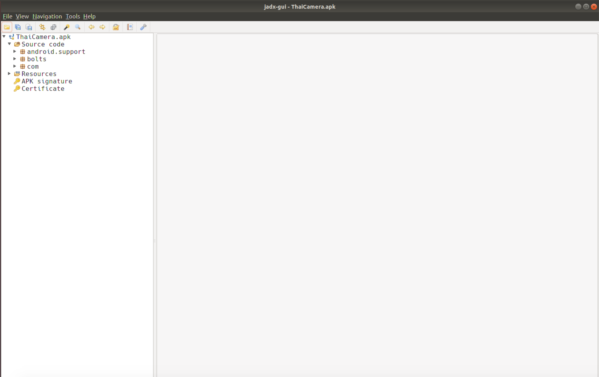

#### Table of Contents

1. [Introduction](index.html)
1. [Android Application Fundamentals](app_fundamentals.html)
1. [Getting Started with Reversing Android Apps](reversing_intro.html)
    * [Exercise 1](reversing_intro.html#exercise-1---beginning-re-with-jadx)
1. [Reverse Engineering Android Apps - DEX Bytecode](reversing_dex.html)
	* [Exercise 2](reversing_dex.html#exercise-2---reverse-engineer-the-dex)
	* *Exercises 3 & 4 Coming Soon*
1. [Reverse Engineering Android Apps - Native Libraries](reversing_native_libs.html)
	* [Exercise 5](reversing_native_libs.html#exercise-5---find-the-address-of-the-native-function)
	* [Exercise 6](reversing_native_libs.html#exercise-6---find-and-reverse-the-native-function)

# 3. Getting Started with Reversing Android Apps
Now that we've reviewed the basics of Android applications, it's time to start reversing them!

## Starting Points for RE
One of the main keys of reverse engineering, regardless of platform, that all reverse engineers need to do, is figure out where to start their analysis. As a reverse engineer, when you've decided that your next step to solve your problem/answer your question is to use static analysis, then you need to know where you want to begin the static analysis.

Android applications can be very large and realistically, you likely won't be able to review every line of code. So where do you begin? My guidance when deciding where to begin doing static analysis is:

1. **What is your goal?** In *most* cases, you are doing RE/static analysis to answer a specific question. Remember what that is and go back to it often. It's very easy to go down a rabbit hole of code that is not related to the problem you're trying to solve.
1. **API Calls** Most interesting behaviors that you may want to identify in Android, ultimately come down to a single, or a set of API calls. For example, let's say you're evaluating an application to see if it's doing [Premium SMS Fraud](https://developers.google.com/android/play-protect/phacategories#billing-fraud). Premium SMS Fraud means that an app is sending a premium SMS message without user consent. Therefore, to do the fraud, the app must send an SMS message. There's a finite number of API calls that will allow an application to send an SMS message. For example, `sendTextMessage`, `sendMultipartMessage`,`smsto:`. Therefore one of the key places to begin analysis, is to find the API calls that are required for the behavior you're interested in, and then search for them in your application. You can then begin your reversing around those API calls.
1. **App Entry Points** In many cases, you're only interested in code that can be executed, not dead code, in the application. Therefore, starting at an application entry point (detailed in [this section](app_fundamental.html#application-entry-points)) is a good choice if you're not sure where else to start.
1. **Decryption Methods** Java largely relies on strings to do many of its operations. For example, to send intents or call methods through reflection. If your application has no human readable strings, then it likely means its obfuscated or encrypted. A good starting point is to find if either "jumbled" strings or binary arrays are all passed to the same methods. If they are, those methods are likely the deobfuscation or decryption methods. 

## Exercise #1 - Beginning RE with jadx

In Exercise #1, we're going to practice coming up with the classes where we would begin our RE analysis. Your goal is to come up with a class or classes that you think would be a good place to begin your analysis. The sample is the ThaiCamera.apk. You can find this sample in the VM at `~/samples/ThaiCamera.apk`. The SHA256 digest of this sample is 55da412157e93153e419c3385ebcd5335bd0d0c3f77a75e2d2413dd128270be2.

### Goal
The goal of this exercise is to:

1. Learn to use jadx for reverse engineering APKs
1. Practice identifying class(es) that would be good starting points to begin your revering

### Exercise Context
You are a malware analyst for Android applications. You are concerned that this sample maybe doing premium SMS fraud, meaning that it sends an SMS to a premium phone number without disclosure & user consent.

### Instructions

1. Start jadx by opening the terminal in the VM and running the `jadx-gui` command in the terminal.
1. Open ThaiCamera.apk in the jadx GUI. It's in the VM's path at `~/samples/ThaiCamera.apk`. When you open the application in jadx, you will see the following. Under the Source Code heading, the packages (namespaces for the Java classes) included in the application. 
1. By clicking on the expansion tab of "Resources", you can see the contents of the APK. Some of the most interesting are the Manifest (`AndroidManifest.xml`), `classes.dex` (contains the DEX bytecode that is decompiled under the "Source Code" tab), and the `assets/` folder which contains any other files the APK may need to run. 
1. Open AndroidManifest.xml and identify any of the application entry points described in the [Application Entry Points](app_fundamentals.html#application-entry-points) section.
1. Using the information gathered in the previous step and the [Starting Points for RE](#starting-points-for-re) section above. Decide on a class or classes, that you think would be classes that you'd begin analyzing when you start your reversing.

[//]: # TODO write answer pages for the different steps.
*Coming Soon: Answer videos*

[**NEXT** > 4. Reverse Engineering Android Apps - DEX Bytecode](reversing_dex.html)

